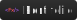

<h1
  align="center"
>
  🦉 Olá, eu sou Felix!
</h1>

  Sou graduado em Análise e Desenvolvimento de Sistemas pela Fatec São Caetano do Sul e pós-graduado em Desenvolvimento de Games pela Unopar. Tenho experiência trabalhando com desenvolvimento FullStack porém, atualmente, busco uma oportunidade na área de jogos.

  
  
  
  [%2095331--1965-25D366?style=flat&logo=whatsapp&logoColor=white)](https://wa.me/5511953311965 "+55 (11) 95331-1965")

  Para saber mais sobre mim, você pode visitar meu <a href="https://felix-xilef.github.io/">Portifólio</a>

